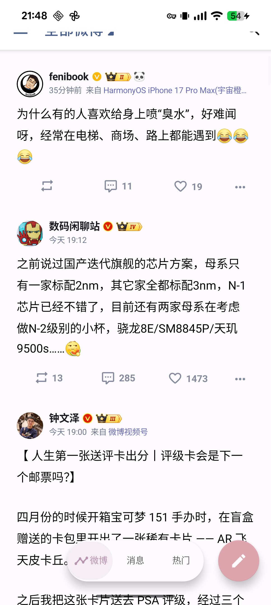
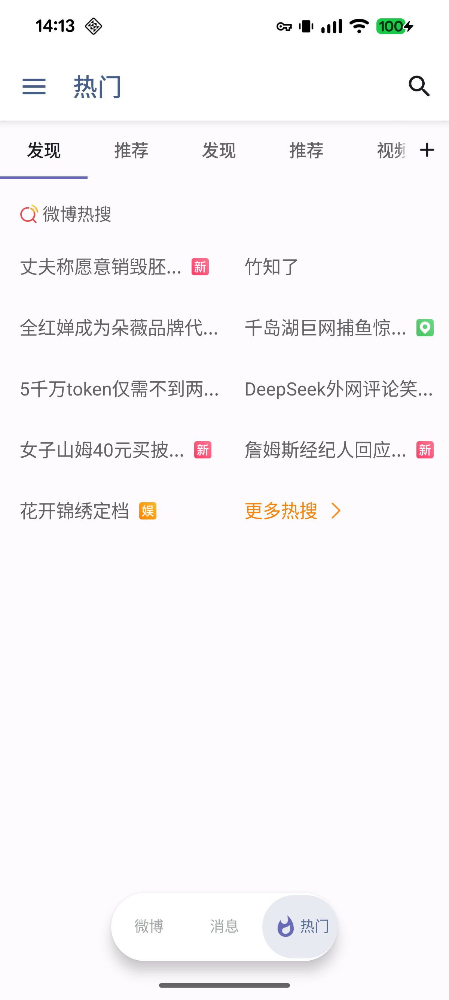
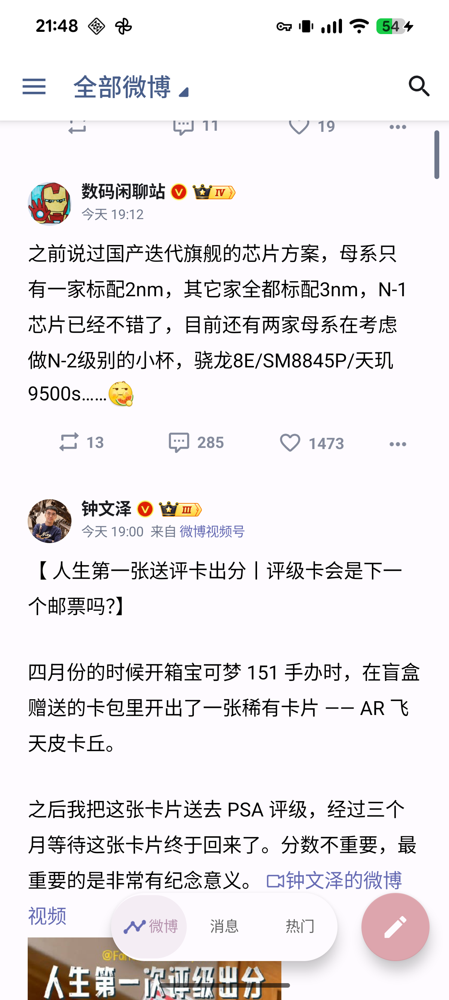
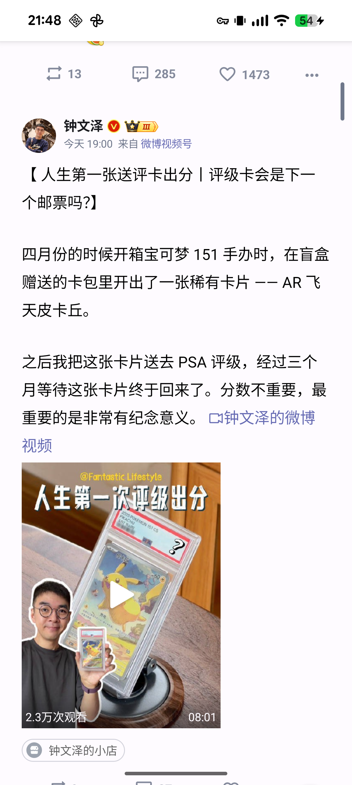
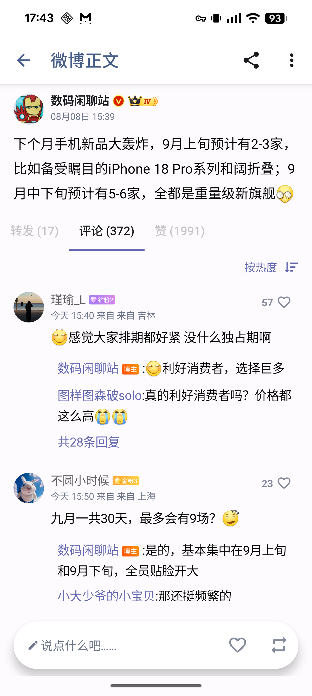
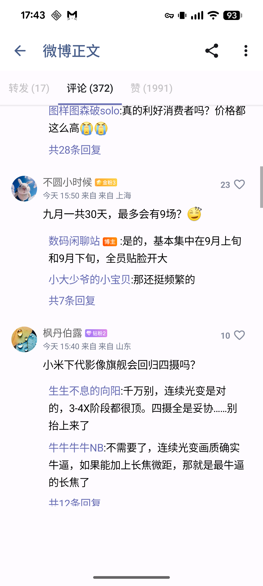

# Share Floating Navigation

面向 Share 3.9.6 Android 客户端的 APK 级 UI 修补项目。在保留原有页面、ViewPager、发布流程、登录、网络层与 native 库行为的前提下，为主界面加入悬浮胶囊底栏，并修复新版 Android 上的主题同步、搜索转场和手势导航区域显示问题。

> 这是非官方修改项目，与 Share 原作者及相关平台无隶属或合作关系。请在确认来源、签名和适用风险后自行安装。

## 界面预览

| 微博 | 消息 | 热门 |
| --- | --- | --- |
|  |  |  |

| 滚动时显示 | 向下浏览后隐藏 |
| --- | --- |
|  |  |

| 正文操作栏显示 | 向下浏览后隐藏 |
| --- | --- |
|  |  |

## 主要改动

- 将原底栏改为居中的悬浮胶囊，保留“微博 / 消息 / 热门”三个入口。
- 选中项显示图标与文字，使用唯一的移动指示器完成切换动画。
- 向下浏览累计超过 24dp 后隐藏底栏，反向手势立即恢复；程序滚动不会误触发。
- 分别处理滚动和输入法隐藏状态，并让底栏与发布按钮避开手势导航区域。
- 根据正文实际使用的主题背景同步底栏明暗，支持冷启动和运行中浅色 / 深色切换。
- 将微博正文页的评论、点赞和转发操作栏改为悬浮胶囊，并沿用向下隐藏、反向恢复和手势安全区规则。
- 修复 Android 16 上主页面进入搜索时短暂出现黑帧的问题。
- 修复 Android 16 上发表评论时编辑器上方显示黑屏的问题。
- 让微博热搜正文延伸至透明手势导航区域，消除底部独立色带。
- 保留“热门 > 发现”的微博热搜内容，移除人物 / 直播入口和图片推荐卡。

## 下载与安装

最新构建产物：[下载 Share_floating_navigation_ui_fixed.apk](https://github.com/Zelayan/share/releases/download/v3.9.6-floating-navigation.3/Share_floating_navigation_ui_fixed.apk)（[Release 说明](https://github.com/Zelayan/share/releases/tag/v3.9.6-floating-navigation.3)）

| 项目 | 值 |
| --- | --- |
| 包名 | `com.hengye.share` |
| 版本 | `3.9.6`（versionCode `925`） |
| Android SDK | minSdk `21`，targetSdk `29` |
| APK SHA-256 | `f423fa85e1038bcea48531db8714180b05199989611d079f63bbf8912a1094ef` |
| 签名 | APK Signature Scheme v1 / v2 / v3 |

该 APK 使用独立证书签名，不是原版 Share 的发布签名。设备上如果已安装同包名但签名不同的版本，需要先卸载原应用再安装；卸载会清除应用本地数据，请提前备份。后续覆盖升级必须继续使用相同证书。

可在本地核对文件摘要：

```sh
shasum -a 256 artifacts/Share_floating_navigation_ui_fixed.apk
```

## 构建

需要准备：

- Java Runtime / JDK
- Android SDK Build Tools 36.0.0，或通过 `BUILD_TOOLS_DIR` 指定其他包含 `zipalign`、`apksigner` 的版本
- 与已安装版本一致的签名 keystore

仓库已包含 apktool 2.9.3 和统一构建脚本。将签名材料放在脚本约定的位置后，通过环境变量传入密码：

```sh
export ANDROID_SDK_ROOT=/path/to/android-sdk
export SHARE_KEYSTORE_PASSWORD='your-keystore-password'
scripts/build_signed.sh
```

也可以设置 `BUILD_TOOLS_DIR`，直接指定 Android Build Tools 目录。脚本会依次完成 apktool 重建、zipalign、v1 / v2 / v3 签名验证和 SHA-256 输出，最终覆盖 `artifacts/Share_floating_navigation_ui_fixed.apk`。

## 回归检查

以下静态测试覆盖本项目新增的主题判断、微博热搜手势区域、热门页清理逻辑及热搜结果页操作栏：

```sh
scripts/test_theme_detection.sh
scripts/test_hot_search_navigation.sh
scripts/test_hot_page_cleanup.sh
scripts/test_status_action_bar.sh
scripts/test_search_result_action_bar.sh
```

当前 APK 已在 Xiaomi `24129PN74C` 上完成主要真机验证：Android 16 / API 36、1200 x 2670、520dpi、手势导航模式。已验证三页切换、主底栏与正文操作栏滚动显隐、浅色 / 深色主题同步、透明手势区域、搜索转场、评论编辑器透明转换、热门页清理，以及 APK 对齐和 v1 / v2 / v3 签名。

尚未完整覆盖三键导航、输入法开关、屏幕旋转、大字体和 TalkBack；其他设备与系统版本可能存在兼容性差异。完整步骤见[验收清单](artifacts/Share_floating_navigation_验收清单.md)。

## 仓库结构

```text
.
├── original/                 # 原始 APK 基线
├── decoded/share_full/       # apktool 解包后的可重建工程
├── artifacts/                # 当前 APK 与验收资料
├── screenshots/              # 真机截图
├── scripts/                  # 构建与回归检查脚本
├── tools/apktool.jar         # apktool 2.9.3
├── CHANGELOG.md              # 变更记录
└── CONTEXT.md                # 实现背景、约束和验证状态
```

继续修改前请先阅读[项目上下文](CONTEXT.md)和[变更记录](CHANGELOG.md)，避免破坏原有业务逻辑、签名升级链或已验证的兼容性修复。

## 免责声明

本仓库仅用于技术研究与个人设备兼容性调整，不提供原项目官方支持。使用者应自行确认 APK、账号、数据和平台规则相关风险，并遵守适用的法律法规及服务条款。

本仓库当前未附加开源许可证；公开可见不等于授予复制、修改或再分发权利。
